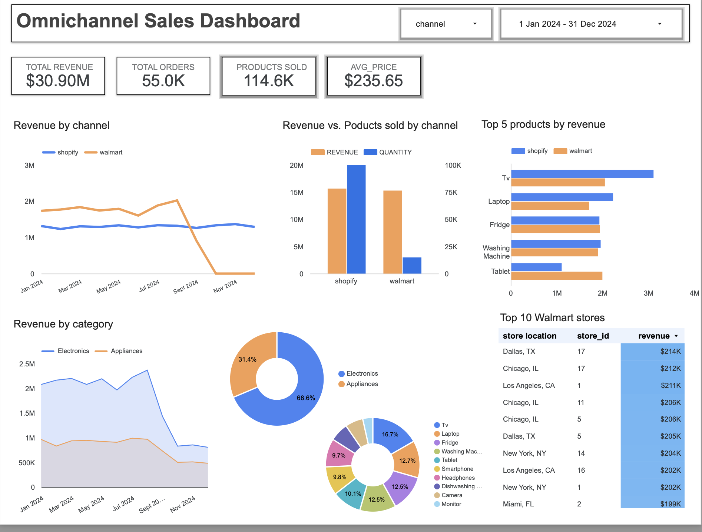

# Retail Omnichannel Sales Pipeline

## Project Overview

This project provides a comprehensive end-to-end data pipeline solution for a mid-sized retailer, aiming to unify its **online (Shopify)** and **in-store (Walmart)** sales data. The goal is to provide a single source of truth for all sales metrics, enabling data-driven decisions on inventory, pricing, and marketing strategies.

The pipeline is built on a modern data stack, leveraging **Snowflake** for data warehousing, **dbt Core** for data transformation and modeling, and **Google Looker Studio** for interactive visualization.

---

## Business Case

Operating across multiple sales channels presents a major challenge in data fragmentation. This project addresses this by:  

- **Tracking Revenue Across Channels**: Comparing online vs. in-store performance in real time.  
- **Identifying Best-Selling Products**: Determining top products overall and by channel to optimize inventory stocking.  
- **Reducing Operational Inefficiencies**: Eliminating manual reconciliation of separate reports, saving time, and reducing errors.  
- **Unifying Disparate Data Sources**: Integrating Shopify e-commerce and Walmart in-store data into a centralized data warehouse.

---

## Data Pipeline Architecture

The pipeline follows a standard Extract, Load, and Transform (ELT) workflow:

1. **Extract & Load**:  
   - Raw sales data from **Walmart** (CSV) and **Shopify** (CSV) is ingested daily and loaded into staging tables in Snowflake.  
   - The ingestion process is automated via scheduled jobs, ensuring continuous updates of the data warehouse.  

2. **Transform & Model (dbt Core)**: dbt is used to clean, standardize, and transform raw data into a **star schema** model. Key transformations include:  
   - Standardizing **date formats** across all tables for consistent temporal analysis.  
   - Normalizing **product categories** and **product names** to maintain consistency between Shopify and Walmart data.  
   - Enriching sales data with dimension tables (`dim_products`, `dim_stores`, `dim_dates`).  
   - Deriving metrics such as revenue per product, units sold, and average price.  
   - Handling missing or inconsistent data gracefully.  
   - Ensuring compatibility with both channels' formats (Shopify CSV vs Walmart CSV).  

3. **Data Quality & Testing**:  
   - Implemented **automatic dbt tests** for uniqueness, non-null constraints, referential integrity, and value ranges.  
   - Added **custom tests** to check category consistency, valid product codes, and correct date ranges.  
   - Continuous monitoring ensures that any anomalies or missing data are flagged before they reach the dashboard.  

4. **Visualization (Google Looker Studio)**:  
   - Cleaned and modeled data is connected to Google Looker Studio.  
   - Dashboard updates automatically with every new data ingestion, providing stakeholders with near real-time insights.  

---

## Exploratory Data Analysis (EDA) & Key Findings

### Overall Sales Performance

- **Total Revenue**: $30.90 million  
- **Total Orders**: 55.0K  
- **Products Sold**: 114.6K  
- **Average Price per Product**: $235.65  

### Channel Performance (Shopify vs. Walmart)

- **Revenue**: Shopify ~$15M, Walmart slightly below $15M  
- **Quantity Sold**: Shopify ~100K units, Walmart ~12.5K units  
- **Temporal Trends**: For Walmart, no sales are recorded beyond September 2024 due to missing data, not a drop in performance. Automated ingestion jobs ensure new Walmart data will continue to update the warehouse.  

### Product Performance

- **Category Breakdown**: Electronics 68.6% of total revenue, Appliances 31.4%  
- **Top Products by Revenue**: TV, Laptop, Fridge, Washing Machine, Tablet  
- **Category-Specific Trends**: Normalized categories allow for accurate cross-channel comparison and top-selling product analysis.

---

## Dashboard Insights

The dashboard provides an **interactive view of omnichannel performance**, including:
- Channel-specific revenue and quantity sold  
- Product category breakdowns  
- Temporal trends with automated daily updates  
- Derived KPIs such as average product price and revenue per store  

> The Looker Studio dashboard updates automatically with every data ingestion, ensuring stakeholders always have access to the latest insights.

---

## Conclusions & Future Steps

The implemented data pipeline successfully unifies sales data from Shopify and Walmart, providing a **single source of truth**. Key achievements include:

- Fully standardized and transformed sales and dimension data, enabling accurate analytics.  
- Automated ingestion and transformation jobs, reducing manual work and ensuring up-to-date dashboards.  
- Comprehensive data quality monitoring through automatic and custom dbt tests.  
- A robust and flexible data model that can easily integrate additional sales channels in the future.

Future steps could include:  

- **Granular Analysis**: Drill down into Walmart data by store location or product category as new data arrives.  
- **Demand Forecasting**: Utilize `forecasted_demand` and `actual_demand` columns to build predictive models for inventory optimization.  
- **Marketing Campaign Analysis**: Combine sales data with marketing spend to measure ROI across channels.
